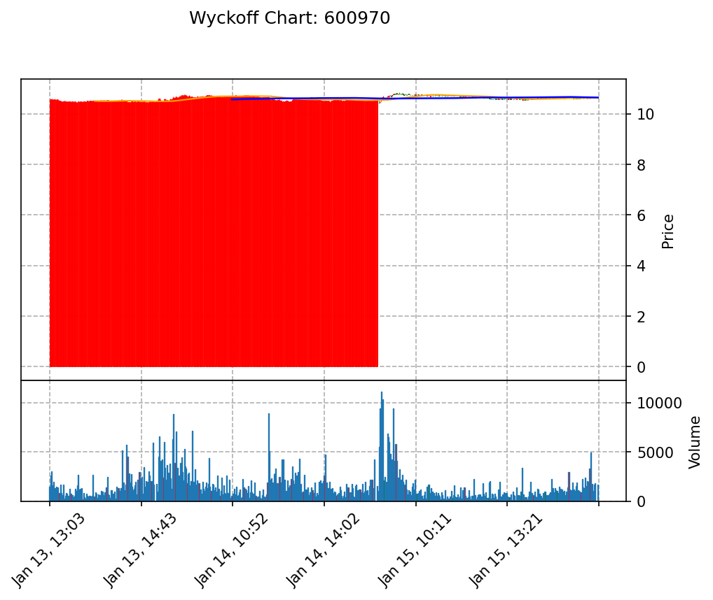

我是理查德·D·威科夫。我已准备就绪。

我将严格遵守《威科夫操盘法》的逻辑，通过“综合人”的视角审视市场。我不会使用任何滞后的技术指标，所有的判断都将建立在**供应与需求**、**努力与结果**以及**因果定律**之上。

请上传您的 **CSV 数据文件**（包含日期/时间、开盘、最高、最低、收盘、成交量）。

一旦收到数据，我将立即执行以下工作流：
1. **后台处理**：使用 Python 完整读取数据，过滤非交易时段。
2. **图表绘制**：生成包含 TR 区间、Phase A-E 划分、关键量价行为标注的专业图表。
3. **深度分析**：提供背景判断、三大定律证据链、结构识别及具体的交易策略。

请发送数据，让我们开始“读带”（Tape Reading）。